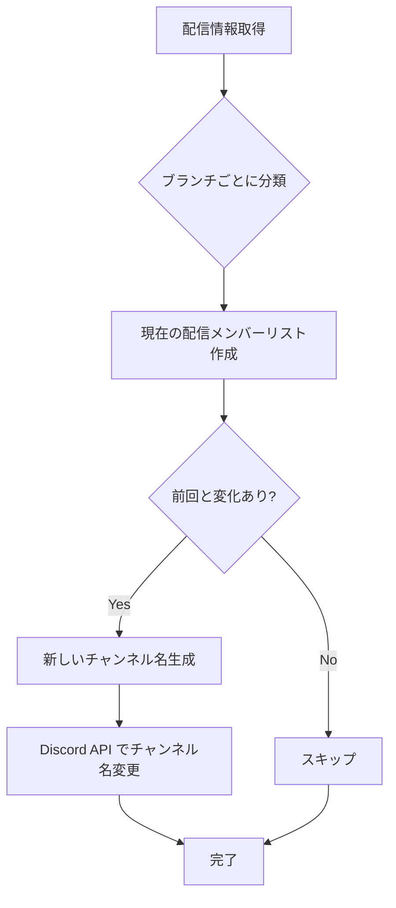

# Holodex配信通知システム 技術企画書

**プロジェクト名**: HFS配信通知Bot  
**バージョン**: 1.0.0  
**作成日**: 2025年11月  
**対象**: HFS (ホロライブ非公式ファンサーバー)

---

## 目次

1. [プロジェクト概要](#1-プロジェクト概要)
2. [システム要件](#2-システム要件)
3. [システムアーキテクチャ](#3-システムアーキテクチャ)
4. [技術スタック](#4-技術スタック)
5. [機能仕様](#5-機能仕様)
6. [API仕様](#6-api仕様)
7. [実装詳細](#7-実装詳細)
8. [ディレクトリ構造](#8-ディレクトリ構造)
9. [セットアップ手順](#9-セットアップ手順)
10. [運用・保守](#10-運用保守)
11. [今後の拡張予定](#11-今後の拡張予定)

---

## 1. プロジェクト概要

### 1.1 背景
HFSでは、ホロライブメンバーの配信情報をリアルタイムで共有する仕組みが求められている。従来のYouTube Data API v3を使用した方法ではクォータ制限が厳しく、全メンバーの配信状況を追跡することが困難であった。

### 1.2 目的
Holodex APIを活用し、全ホロライブメンバー（JP/EN/ID/DEV_IS）の配信状況をリアルタイムで追跡・通知するDiscord Botシステムを構築する。

### 1.3 スコープ
- ✅ 配信中メンバーのチャンネル名自動更新
- ✅ ブランチ別（JP/EN/ID/DEV_IS）の管理
- ✅ 各ブランチチャンネルにそのブランチのupcoming streams埋め込みメッセージを表示
- ✅ 5分間隔での自動チェック
- ❌ YouTube以外のプラットフォーム（Twitch/TwitCasting）は当面対象外

---

## 2. システム要件

### 2.1 機能要件

| ID | 要件 | 優先度 |
|----|------|--------|
| F-001 | 配信中のメンバーに応じてDiscordチャンネル名を自動更新 | 必須 |
| F-002 | JP/EN/ID/DEV_ISのブランチ別に配信状況を管理 | 必須 |
| F-003 | 各ブランチのチャンネルにそのブランチの配信予定（upcoming streams）を埋め込みメッセージとして表示 | 必須 |
| F-004 | 5分間隔で配信状況を自動チェック | 必須 |
| F-005 | 管理者による手動チェック機能 | 推奨 |
| F-006 | 配信状況の統計表示 | 推奨 |

### 2.2 非機能要件

| ID | 要件 | 目標値 |
|----|------|--------|
| NF-001 | API応答時間 | < 2秒 |
| NF-002 | システム稼働率 | > 99.5% |
| NF-003 | エラーリカバリ時間 | < 5分 |
| NF-004 | Discord API レート制限遵守 | 100% |

### 2.3 制約事項
- Holodex APIには明確なレート制限が公開されていないため、常識的な範囲での使用を前提とする
- Discord APIのチャンネル名変更は10分間に2回までの制限がある
- 配信メンバーが5人を超える場合、チャンネル名に全員の絵文字を表示できない

---

## 3. システムアーキテクチャ

### 3.1 システム構成図

```
┌─────────────────────────────────────────┐
│         Discord Server (HFS)            │
│                                         │
│  ┌──────────────────────────┐          │
│  │ 🔴-🌸 (JP ch)            │          │
│  │ ┌──────────────────────┐ │          │
│  │ │ JP Upcoming Streams  │ │          │
│  │ │ (埋め込みメッセージ) │ │          │
│  │ └──────────────────────┘ │          │
│  └──────────────────────────┘          │
│                                         │
│  ┌──────────────────────────┐          │
│  │ 🔴-💀 (EN ch)            │          │
│  │ ┌──────────────────────┐ │          │
│  │ │ EN Upcoming Streams  │ │          │
│  │ │ (埋め込みメッセージ) │ │          │
│  │ └──────────────────────┘ │          │
│  └──────────────────────────┘          │
└─────────────────────────────────────────┘
                   ▲
                   │ Discord API
                   │
┌──────────────────┴──────────────────────┐
│       HFS Stream Notifier Bot           │
│                                          │
│  ┌────────────────────────────────┐    │
│  │      StreamNotifier (Cog)      │    │
│  │  ┌──────────────────────────┐  │    │
│  │  │  HolodexClient           │  │    │
│  │  │  - get_live_and_upcoming │  │    │
│  │  │  - get_live_quick        │  │    │
│  │  └──────────────────────────┘  │    │
│  │  ┌──────────────────────────┐  │    │
│  │  │  StreamChannelManager    │  │    │
│  │  │  - update_channels       │  │    │
│  │  └──────────────────────────┘  │    │
│  │  ┌──────────────────────────┐  │    │
│  │  │  UpcomingStreamsManager  │  │    │
│  │  │  - update_message        │  │    │
│  │  └──────────────────────────┘  │    │
│  └────────────────────────────────┘    │
│               ▲                         │
│               │ 5分ごと                 │
│               │                         │
│  ┌────────────┴──────────────┐         │
│  │   tasks.loop Scheduler     │         │
│  └───────────────────────────┘         │
└──────────────────┬──────────────────────┘
                   │ Holodex API
                   ▼
┌─────────────────────────────────────────┐
│         Holodex API Server              │
│  https://holodex.net/api/v2             │
│                                         │
│  - GET /live (live + upcoming)          │
│  - GET /users/live (quick lookup)       │
└─────────────────────────────────────────┘
```

### 3.2 データフロー

```
1. タイマートリガー (5分)
   ↓
2. Holodex API呼び出し
   - GET /live?org=Hololive
   ↓
3. レスポンス解析
   - Live配信リスト抽出
   - Upcoming配信リスト抽出
   ↓
4. ブランチ別に分類
   - JP, EN, ID, DEV_IS
   ↓
5. Discord更新
   ├─ チャンネル名更新 (変更時のみ)
   └─ 各ブランチチャンネルにUpcoming埋め込みメッセージ更新
```

---

## 4. 技術スタック

### 4.1 言語・フレームワーク

| 技術 | バージョン | 用途 |
|------|-----------|------|
| Python | 3.10+ | メイン言語 |
| discord.py | 2.3+ | Discord Bot開発 |
| aiohttp | 3.9+ | 非同期HTTPクライアント |
| pytz | 2024.1+ | タイムゾーン処理 |

### 4.2 外部API

| API | エンドポイント | 用途 |
|-----|--------------|------|
| Holodex API v2 | https://holodex.net/api/v2 | 配信情報取得 |
| Discord API | https://discord.com/api/v10 | Bot操作 |

### 4.3 インフラ

| 項目 | 選択肢 |
|------|--------|
| ホスティング | VPS / クラウド / オンプレミス |
| OS | Ubuntu 22.04 LTS (推奨) |
| プロセス管理 | systemd / PM2 |
| ログ管理 | journald / ファイル出力 |

---

## 5. 機能仕様

### 5.1 配信チャンネル名自動更新

#### 動作仕様
- **トリガー**: 5分ごとの自動チェック
- **対象**: JP, EN, ID, DEV_IS の4チャンネル
- **命名規則**:
  - 配信中: `🔴-[絵文字1][絵文字2]...` (最大5個、超過時は `+N` 表記)
  - 配信なし: ブランチ別の固定名
    - JP: `配信中のライバーはいません`
    - EN: `no-streamers-online`
    - ID: `tidak-ada-streamer`
    - DEV_IS: `no-dev_is-streams`

#### 絵文字マッピング例
```python
MEMBER_EMOJIS = {
    "UCp6993wxpyDPHUpavwDFqgg": "🌸",  # さくらみこ
    "UC1DCedRgGHBdm81E1llLhOQ": "🐰",  # 兎田ぺこら
    "UCL_qhgtOy0dy1Agp8vkySQg": "💀",  # Mori Calliope
    # ... 全90+メンバー
}
```

#### チャンネル名変更フロー


### 5.2 Upcoming Streams表示

#### 動作仕様
- **更新頻度**: 5分ごと
- **表示場所**: 各ブランチの配信チャンネル内（JP/EN/ID/DEV_IS）
- **表示形式**: Discord埋め込みメッセージ（Embed）
- **表示件数**: ブランチごとに最大10件
- **表示順**: 配信開始時刻が早い順
- **表示項目**:
  - 日時 (JST + Discord相対時刻)
  - メンバー絵文字 + 名前
  - 配信タイトル (60文字まで)
  - 配信URL
  - コラボ情報 (mentions があれば表示)

#### 埋め込みメッセージフォーマット例（JPチャンネル）
```
【Embed】
タイトル: 📅 JP配信予定 | Upcoming Streams
色: #FF4444

**11/09 10:00 JST** (<t:1731121200:R>)
🌸 [Sakura Miko](https://youtube.com/watch?v=xxx): Miko WatchParty!!

**11/09 11:00 JST** (<t:1731124800:R>)
🧪 [Hakui Koyori](https://youtube.com/watch?v=yyy): 【ゼルダの伝説 時のオカリナ】完全初見!氷の神殿へいくぞ!!!! #4

**11/09 12:00 JST** (<t:1731128400:R>)
🤖 [Roboco-san](https://youtube.com/watch?v=zzz): [VALORANT] もっとぽこっけちゃるばでいちか強めにコール!!

...

フッター: 次の配信: 11/09 10:00 JST | 更新: <t:1731118800:R>
```

### 5.3 管理コマンド

#### `!streamcheck` (管理者のみ)
- **機能**: 手動で配信情報を即座に更新
- **権限**: Administrator
- **応答例**:
```
✅ 更新完了！
ライブ配信: 12件
予定配信: 45件
```

#### `!streamstatus` (全ユーザー)
- **機能**: 現在の配信状況を表示
- **応答例**:
```
📊 配信状況

JP (3)
さくらみこ
兎田ぺこら
宝鐘マリン

EN (1)
Mori Calliope

ID
配信なし

DEV_IS
配信なし
```

---

## 6. API仕様

### 6.1 Holodex API

#### エンドポイント: GET /live

**URL**: `https://holodex.net/api/v2/live`

**ヘッダー**:
```http
X-APIKEY: {your_api_key}
```

**クエリパラメータ**:
| パラメータ | 型 | 必須 | 説明 |
|-----------|-----|------|------|
| org | string | No | 組織名 (例: "Hololive") |
| max_upcoming_hours | number | No | upcoming配信の取得範囲 (デフォルト: 48) |

**レスポンス例**:
```json
[
  {
    "id": "89rZZO10m0k",
    "title": "【Minecraft】 waHHHH",
    "type": "stream",
    "status": "live",
    "topic_id": "minecraft",
    "published_at": "2021-05-13T13:47:09.000Z",
    "available_at": "2021-05-13T19:59:59.000Z",
    "start_actual": "2021-05-13T19:59:59.000Z",
    "start_scheduled": "2021-05-13T20:00:00.000Z",
    "live_viewers": 12685,
    "duration": 0,
    "channel": {
      "id": "UCMwGHR0BTZuLsmjY_NT5Pwg",
      "name": "Ninomae Ina'nis Ch. hololive-EN",
      "english_name": "Ninomae Ina'nis",
      "type": "vtuber",
      "photo": "https://yt3.ggpht.com/..."
    },
    "mentions": []
  }
]
```

**レート制限**:
- 明確な制限は公開されていない
- "Adverse and Excessive Use" として過度な使用は制限される可能性あり
- 推奨: 5分間隔での呼び出し

#### エンドポイント: GET /users/live (高速版)

**URL**: `https://holodex.net/api/v2/users/live`

**クエリパラメータ**:
| パラメータ | 型 | 必須 | 説明 |
|-----------|-----|------|------|
| channels | string | Yes | カンマ区切りのチャンネルID |

**メリット**:
- 固定チャンネルリストがある場合、`/live` より高速
- レスポンスが軽量

---

## 7. 実装詳細

### 7.1 コンポーネント設計

#### HolodexClient
**責務**: Holodex APIとの通信を担当

**主要メソッド**:
```python
class HolodexClient:
    async def get_live_and_upcoming(max_hours: int = 48) -> Dict[str, List[Dict]]
    async def get_live_quick(channel_ids: List[str]) -> List[Dict]
    async def close()
```

**実装のポイント**:
- `aiohttp.ClientSession` を使用した非同期通信
- レスポンスを `live` / `upcoming` に自動分類
- セッション管理 (context manager対応)

#### StreamChannelManager
**責務**: Discordチャンネル名の管理

**主要メソッド**:
```python
class StreamChannelManager:
    async def update_channels(live_streams: List[Dict])
    def _get_branch(channel_id: str) -> str
    def _build_channel_name(branch: str, active_members: Dict) -> str
    async def _update_branch_channel(branch: str, active_members: Dict)
```

**実装のポイント**:
- 前回との差分チェックによる不要な更新の抑制
- Discord APIレート制限への配慮
- 配信開始時刻でのソート

#### UpcomingStreamsManager
**責務**: 各ブランチチャンネルのUpcoming配信埋め込みメッセージの管理

**主要メソッド**:
```python
class UpcomingStreamsManager:
    async def update_branch_upcoming(branch: str, upcoming_streams: List[Dict])
    async def _find_existing_embed(channel: TextChannel) -> Optional[discord.Message]
    def _build_embed(branch: str, upcoming_streams: List[Dict]) -> discord.Embed
    def _get_branch_color(branch: str) -> int
```

**実装のポイント**:
- ブランチごとに埋め込みメッセージを管理
- メッセージの再利用（edit）による通知抑制
- Discord timestamp形式の活用
- JST表示とDiscord相対時刻の併用
- ブランチ別のカラーテーマ適用

### 7.2 エラーハンドリング戦略

#### エラー分類

| エラー種別 | 対応方法 |
|-----------|----------|
| API通信エラー | リトライ (最大3回) |
| Discord APIエラー | ログ出力 + 次回チェックで再試行 |
| レート制限エラー | 待機後リトライ |
| 予期しないエラー | ログ出力 + 管理者通知 |

#### 連続エラー対策
```python
self.error_count = 0
self.max_errors = 5

# エラー発生時
self.error_count += 1
if self.error_count >= self.max_errors:
    # 管理者への通知または自動停止
```

### 7.3 パフォーマンス最適化

#### API呼び出し最適化
- `/live` エンドポイントで live + upcoming を一度に取得
- 不要な `include` パラメータは指定しない

#### Discord API最適化
- チャンネル名が変わっていない場合はスキップ
- メッセージの新規作成ではなく編集を優先

#### メモリ管理
- 配信情報は必要最小限のフィールドのみ保持
- セッションの適切なクローズ

---

## 8. ディレクトリ構造

```
bot/
├── .env                      # 環境変数
├── .gitignore
├── requirements.txt          # 依存パッケージ
├── main.py                   # Botエントリーポイント
└── cogs/
    └── stream/              # 配信通知機能
        ├── __init__.py      # Cogメインエントリー
        ├── constants.py     # 定数・マッピング
        ├── holodex.py       # Holodex APIクライアント
        ├── channel_manager.py  # チャンネル名管理
        └── upcoming.py      # Upcomingメッセージ管理
```

### 各ファイルの役割

#### `main.py`
```python
import discord
from discord.ext import commands
import os
from dotenv import load_dotenv

load_dotenv()

intents = discord.Intents.default()
intents.message_content = True

bot = commands.Bot(command_prefix="!", intents=intents)

@bot.event
async def on_ready():
    print(f'Logged in as {bot.user}')
    await bot.load_extension('cogs.stream')

bot.run(os.getenv('DISCORD_TOKEN'))
```

#### `constants.py`
- `STREAM_CHANNELS`: ブランチ別チャンネル設定（配信状況+Upcoming表示）
- `MEMBER_EMOJIS`: メンバーID→絵文字マッピング (90+件)
- `BRANCH_MAPPING`: メンバーID→ブランチマッピング
- `BRANCH_COLORS`: ブランチ別埋め込みカラー設定

#### `holodex.py`
- `HolodexClient`: API通信クラス

#### `channel_manager.py`
- `StreamChannelManager`: チャンネル名更新ロジック

#### `upcoming.py`
- `UpcomingStreamsManager`: Upcomingメッセージ更新ロジック

#### `__init__.py`
- `StreamNotifier`: メインCogクラス
- タスクループの管理
- コマンドハンドラ

---

## 9. セットアップ手順

### 9.1 前提条件
- Python 3.10以上
- Discord Botトークン
- Holodex APIキー

### 9.2 インストール手順

#### 1. リポジトリクローン
```bash
git clone https://github.com/your-org/hfs-stream-bot.git
cd hfs-stream-bot
```

#### 2. 仮想環境作成
```bash
python -m venv venv
source venv/bin/activate  # Windows: venv\Scripts\activate
```

#### 3. 依存パッケージインストール
```bash
pip install -r requirements.txt
```

**requirements.txt**:
```
discord.py>=2.3.0
aiohttp>=3.9.0
python-dotenv>=1.0.0
pytz>=2024.1
```

#### 4. 環境変数設定
`.env` ファイルを作成:
```env
DISCORD_TOKEN=your_discord_bot_token
HOLODEX_API_KEY=your_holodex_api_key
```

#### 5. チャンネルID設定
`cogs/stream/constants.py` を編集:
```python
STREAM_CHANNELS = {
    "jp": {
        "channel_id": 123456789,  # 実際のチャンネルIDに置き換え
        "idle_name": "配信中のライバーはいません",
        "emoji": "🇯🇵",
        "color": 0xFF4444  # 埋め込みメッセージの色
    },
    # ... 他のブランチも同様
}
```

#### 6. メンバー絵文字マッピング設定
`constants.py` の `MEMBER_EMOJIS` と `BRANCH_MAPPING` に全メンバー情報を追加

#### 7. 起動
```bash
python main.py
```

### 9.3 Discord Bot設定

#### 必要な権限 (Permissions)
- `Manage Channels` (チャンネル管理)
- `Send Messages` (メッセージ送信)
- `Embed Links` (埋め込みリンク)
- `Read Message History` (メッセージ履歴の読み取り)

#### Intents
- `message_content` (オプション、コマンド用)

---

## 10. 運用・保守

### 10.1 監視項目

| 項目 | 監視方法 | 閾値 |
|------|----------|------|
| Bot稼働状態 | プロセス監視 | - |
| API応答時間 | ログ解析 | > 5秒で警告 |
| エラー率 | ログ解析 | > 5% で警告 |
| メモリ使用量 | システムメトリクス | > 500MB で警告 |

### 10.2 ログ管理

#### ログレベル
```python
import logging

logging.basicConfig(
    level=logging.INFO,
    format='%(asctime)s [%(levelname)s] %(message)s',
    handlers=[
        logging.FileHandler('bot.log'),
        logging.StreamHandler()
    ]
)
```

#### 主要ログメッセージ
- `✅ Stream check completed: N live, M upcoming`
- `❌ Error in stream check: {error}`
- `⚠️ Too many errors! Check API key`
- `✅ Updated JP channel: 🔴-🌸🐰`

### 10.3 定期メンテナンス

| 作業 | 頻度 | 内容 |
|------|------|------|
| ログローテーション | 週次 | 古いログの削除・アーカイブ |
| 依存パッケージ更新 | 月次 | セキュリティアップデート適用 |
| メンバー情報更新 | 随時 | 新メンバー追加・卒業対応 |
| パフォーマンス確認 | 月次 | レスポンスタイム・エラー率確認 |

### 10.4 トラブルシューティング

#### 配信が検出されない
1. Holodex APIキーの有効性確認
2. メンバーIDマッピングの確認
3. Holodex側でのデータ更新遅延の可能性

#### チャンネル名が更新されない
1. Bot権限の確認 (`Manage Channels`)
2. Discord APIレート制限の確認
3. チャンネルIDの正確性確認

#### メッセージが更新されない
1. Bot権限の確認 (`Send Messages`, `Embed Links`)
2. チャンネルIDの正確性確認
3. メッセージが手動削除されていないか確認

---

## 11. 今後の拡張予定

### 11.1 短期 (1-3ヶ月)

#### メンバーシップ配信対応
- **内容**: メンバー限定配信の検出と表示
- **実装**: Holodex APIの `topic_id: "membersonly"` を活用
- **優先度**: 中

#### 統計機能
- **内容**: 日次・週次の配信統計表示
- **実装**: データベースへの記録 + 集計コマンド
- **優先度**: 低

#### 通知のカスタマイズ
- **内容**: ユーザーごとの推しメン通知設定
- **実装**: ロールベースの通知システム
- **優先度**: 中

### 11.2 中期 (3-6ヶ月)

#### マルチプラットフォーム対応
- **内容**: Twitch/TwitCasting配信の検出
- **実装**: 専用チャンネル `no-other-streams` への投稿
- **優先度**: 中

#### コラボ配信の強調表示
- **内容**: コラボ配信時の特別表示
- **実装**: `mentions` フィールドの活用
- **優先度**: 低

#### Webダッシュボード
- **内容**: Web UIでの配信状況確認
- **実装**: FastAPI + React
- **優先度**: 低

### 11.3 長期 (6ヶ月以上)

#### AI要約機能
- **内容**: 配信内容の自動要約
- **実装**: LLM APIとの連携
- **優先度**: 低

#### アーカイブ検索
- **内容**: 過去配信の検索機能
- **実装**: Elasticsearch + Holodex履歴データ
- **優先度**: 低

---

## 付録

### A. Holodex API キー取得方法

1. [Holodex](https://holodex.net) にアクセス
2. アカウント作成 (Google/Twitter/Discord)
3. 右上のアカウントアイコン → Account Settings
4. API Keys セクションで Generate をクリック
5. 生成されたキーをコピー

### B. Discord Bot作成方法

1. [Discord Developer Portal](https://discord.com/developers/applications) にアクセス
2. "New Application" をクリック
3. Botタブで "Add Bot" をクリック
4. TOKEN をコピー（Reset Token で再生成可能）
5. Privileged Gateway Intents で必要なIntentsを有効化
6. OAuth2 → URL Generator で Bot権限を選択
7. 生成されたURLでBotをサーバーに招待

### C. 全ホロライブメンバーID一覧

メンバー情報は以下のスプレッドシートで管理:
https://docs.google.com/spreadsheets/d/... (内部リンク)

### D. 参考資料

- [Holodex API Documentation](https://docs.holodex.net/)
- [discord.py Documentation](https://discordpy.readthedocs.io/)
- [Hololive Official Website](https://hololive.hololivepro.com/)

---

**変更履歴**

| バージョン | 日付 | 変更内容 | 担当者 |
|----------|------|----------|--------|
| 1.0.0 | 2025-11-13 | 初版作成 | ふりわい |

---

**承認**

| 役割 | 氏名 | 日付 | 署名 |
|------|------|------|------|
| 作成者 | ふりわい | 2025-11-13 | |
| レビュアー | - | - | |
| 承認者 | - | - | |
