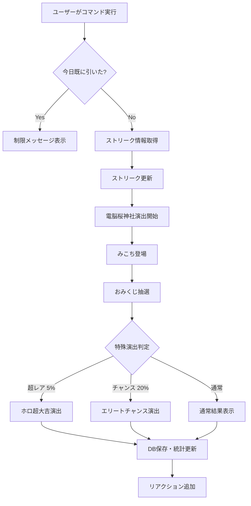

# ホロライブおみくじシステム

## 概要

電脳桜神社のホロライブおみくじシステムは、みこち（さくらみこ）をテーマにした日本の伝統的なおみくじとVtuber文化を融合させた独自のエンゲージメント機能です。

## 主要機能

### 1. ホロおみくじ (`/omikuji`)

#### コマンド
```
/omikuji
/おみくじ
/ホロみくじ
```

#### 機能概要
- **1日1回制限**: 日本時間の深夜0時にリセット
- **連続参拝ボーナス**: 毎日引くことでストリークが増加
- **特殊演出**: 超レア・チャンス演出あり
- **データベース記録**: 全履歴をPostgreSQLに保存

#### 動作フロー



#### 演出ステップ

1. **導入**
   ```
   にゃっはろ～！電脳桜神社へようこそだにぇ🌸
   ```

2. **キャラクター登場**
   ```
   エリート巫女みこちが式神の金時と一緒にお出迎え
   ```

3. **おみくじ開始**
   ```
   **みこち**「今日も良いおみくじが引けるといいにぇ～」
   ```

4. **抽選**
   ```
   電脳乃神が見守る中、デジタルおみくじを開く
   ```

#### 運勢の種類

データベース管理による動的な運勢リスト：

| 運勢 | 重み | 特殊 | 説明 |
|-----|-----|-----|------|
| ホロ超大吉 | 動的 | ✓ | 5%の確率で発動する最高の運勢 |
| 推し大吉 | 高 | ✓ | ホロメンからの祝福 |
| ホロ大吉 | 高 | ✓ | 電脳神社の大吉 |
| 大吉 | 中 | - | 良い運勢 |
| 中吉 | 中 | - | まあまあの運勢 |
| 小吉 | 中 | - | 少し良い運勢 |
| 吉 | 中 | - | 普通の運勢 |
| 末吉 | 低 | - | 微妙な運勢 |
| 凶 | 低 | - | 悪い運勢 |

#### 連続参拝システム

**ストリークカウント**:
- 毎日連続でおみくじを引くとストリークが+1
- ストリークが途切れると1にリセット
- 最高記録は永続的に保存

**ストリークボーナス**:
```python
# 3日ごとに特殊運勢の確率アップ
bonus_weight = current_streak // 3
```

**データベーススキーマ**:
```sql
CREATE TABLE user_omikuji_streaks (
    user_id BIGINT,
    guild_id BIGINT,
    current_streak INTEGER DEFAULT 0,
    max_streak INTEGER DEFAULT 0,
    last_draw_date DATE,
    created_at TIMESTAMP DEFAULT CURRENT_TIMESTAMP,
    updated_at TIMESTAMP DEFAULT CURRENT_TIMESTAMP,
    PRIMARY KEY (user_id, guild_id)
);
```

### 2. タロット運勢 (`/fortune`)

#### コマンド
```
/fortune
/運勢
/ホロ運勢
```

#### 機能概要
- **1日1回制限**: おみくじとは別で1日1回
- **みおしゃテーマ**: 大神ミオのタロット占い
- **ラッキーアイテム**: 今日のラッキーカラー・アイテム・アプリ

#### タロット運勢リスト

```python
TAROT_FORTUNES = [
    {
        "name": "愚者",
        "meaning": "新しい始まり、冒険心、純粋さ",
        "color": "#FFFF00"  # 黄色
    },
    {
        "name": "魔術師",
        "meaning": "創造力、コミュニケーション、技術",
        "color": "#FF0000"  # 赤
    },
    {
        "name": "女教皇",
        "meaning": "直感、神秘、内なる声",
        "color": "#0000FF"  # 青
    },
    # ... 全22枚のタロットカード
]
```

#### ラッキー要素

**ラッキーカラー**（ホロライブメンバーカラー）:
- ホロブルー (#1E90FF)
- さくらピンク (#FF69B4)
- スバルイエロー (#FFD700)
- マリンレッド (#FF0000)
- ぺこらオレンジ (#FF8C00)
- フブキホワイト (#F0F8FF)
- アクアミント (#00FFFF)
- ころねゴールド (#DAA520)
- おかゆパープル (#9370DB)
- わためベージュ (#F5F5DC)

**ラッキーアイテム**:
```python
cyber_lucky_items = [
    "タロットカード", "水晶玉", "占い本",
    "美少女ゲーム", "たい焼き", "アニメグッズ",
    "ゲーミングキーボード", "VRヘッドセット",
    "式神お守り", "電脳アクセサリー",
    "サイバーペンダント", "デジタル数珠", "ホログラム御札"
]
```

**ラッキーアプリ**:
```python
cyber_lucky_apps = [
    "YouTube", "Discord", "Twitter(X)", "Steam",
    "Spotify", "Netflix", "占いアプリ", "タロットアプリ",
    "瞑想アプリ", "アニメ配信アプリ",
    "ゲーム配信アプリ", "VR占いアプリ"
]
```

### 3. ランキングシステム (`/ranking`)

#### コマンド
```
/ranking
/ランキング
/電脳ランキング
```

#### 表示内容
- **トップ5ユーザー**: 現在の連続参拝日数順
- **連続参拝日数**: 現在のストリーク
- **最高記録**: 過去最高のストリーク

#### ランキング表示例

```
🏆 電脳桜神社 連続参拝ランキング
みこちとホロメンたちも応援していますだにぇ！

🥇 1位: ユーザー名
連続参拝: 30日
最高記録: 45日

🥈 2位: ユーザー名
連続参拝: 25日
最高記録: 30日

🥉 3位: ユーザー名
連続参拝: 20日
最高記録: 25日
```

## 管理コマンド

### 運勢管理

#### 運勢の追加 (`/cyber add_fortune`)

**必要権限**: サーバーブースター

```
/cyber add_fortune fortune:"カスタム運勢"
```

**処理フロー**:
1. 既存運勢の重複チェック
2. データベースに新規運勢を追加
3. 重み: 10 (デフォルト)
4. 特殊フラグ: false

#### 運勢の削除 (`/cyber remove_fortune`)

**必要権限**: サーバーブースター

```
/cyber remove_fortune fortune:"削除する運勢"
```

#### 運勢一覧 (`/cyber list_fortunes`)

```
/cyber list_fortunes
```

全運勢をリスト表示：
- 📜 通常運勢
- ✨ 特殊運勢

### デバッグ・管理

#### デバッグモード (`/cyber debug`)

**必要権限**: ボットオーナー

日付制限なしでおみくじ演出をテスト

#### ストリークリセット切り替え (`/cyber toggle_streak_reset`)

**必要権限**: ボットオーナー

ストリーク自動リセットの有効/無効を切り替え

## データベース設計

### テーブル構造

#### omikuji_fortunes (運勢マスター)
```sql
CREATE TABLE omikuji_fortunes (
    id SERIAL PRIMARY KEY,
    name VARCHAR(100) UNIQUE NOT NULL,          -- 内部ID名
    display_name VARCHAR(100) NOT NULL,         -- 表示名
    weight INTEGER DEFAULT 10,                  -- 抽選重み
    is_special BOOLEAN DEFAULT FALSE,           -- 特殊運勢フラグ
    description TEXT,                           -- 説明
    created_at TIMESTAMP DEFAULT CURRENT_TIMESTAMP,
    updated_at TIMESTAMP DEFAULT CURRENT_TIMESTAMP
);
```

#### user_omikuji_history (おみくじ履歴)
```sql
CREATE TABLE user_omikuji_history (
    id SERIAL PRIMARY KEY,
    user_id BIGINT NOT NULL,
    guild_id BIGINT NOT NULL,
    fortune_id INTEGER REFERENCES omikuji_fortunes(id),
    drawn_date DATE NOT NULL,
    is_super_rare BOOLEAN DEFAULT FALSE,
    is_chance BOOLEAN DEFAULT FALSE,
    streak_count INTEGER DEFAULT 0,
    created_at TIMESTAMP DEFAULT CURRENT_TIMESTAMP
);

CREATE INDEX idx_user_omikuji ON user_omikuji_history(user_id, guild_id, drawn_date);
```

#### user_fortune_history (タロット運勢履歴)
```sql
CREATE TABLE user_fortune_history (
    id SERIAL PRIMARY KEY,
    user_id BIGINT NOT NULL,
    guild_id BIGINT NOT NULL,
    fortune_level VARCHAR(100) NOT NULL,
    lucky_color VARCHAR(50),
    lucky_item VARCHAR(100),
    lucky_app VARCHAR(100),
    drawn_date DATE NOT NULL,
    created_at TIMESTAMP DEFAULT CURRENT_TIMESTAMP
);

CREATE INDEX idx_user_fortune ON user_fortune_history(user_id, guild_id, drawn_date);
```

#### omikuji_daily_stats (日次統計)
```sql
CREATE TABLE omikuji_daily_stats (
    id SERIAL PRIMARY KEY,
    guild_id BIGINT NOT NULL,
    stat_date DATE NOT NULL,
    omikuji_count INTEGER DEFAULT 0,
    fortune_count INTEGER DEFAULT 0,
    unique_users INTEGER DEFAULT 0,
    created_at TIMESTAMP DEFAULT CURRENT_TIMESTAMP,
    updated_at TIMESTAMP DEFAULT CURRENT_TIMESTAMP,
    UNIQUE(guild_id, stat_date)
);
```

## 実装詳細

### 重み付き抽選アルゴリズム

```python
async def get_fortunes(self) -> list[dict]:
    """運勢マスターデータを取得"""
    result = await execute_query(
        "SELECT id, name, display_name, weight, is_special FROM omikuji_fortunes ORDER BY weight DESC",
        fetch_type='all'
    )
    return result if result else []

# ストリークボーナスを加算
weights = [
    f['weight'] + (current_streak // 3) if f['is_special'] 
    else f['weight'] 
    for f in fortunes_data
]

# 重み付きランダム選択
selected_fortune = random.choices(fortunes_data, weights=weights, k=1)[0]
```

### 日本時間の処理

```python
# UTC -> JST変換
now_utc = datetime.utcnow()
now_jst = now_utc + timedelta(hours=9)
today_jst = now_jst.date()
today_str = today_jst.isoformat()

# 日付の比較
last_omikuji_date = await self.get_user_last_omikuji(user_id, guild_id)
if last_omikuji_date == today_str and user_id != special_user_id:
    # 今日既に引いている
    return
```

### ストリーク計算ロジック

```python
streak_data = await self.get_user_streak(user_id, guild_id)
current_streak = streak_data['streak']

if streak_data['last_date']:
    last_date = datetime.fromisoformat(streak_data['last_date']).date()
    
    if last_date == today_jst - timedelta(days=1):
        # 連続ログイン
        current_streak += 1
    else:
        # ストリーク途切れ
        if self.streak_reset_enabled:
            current_streak = 1
else:
    current_streak = 1

# ストリーク情報を更新
await self.update_user_streak(user_id, guild_id, current_streak, today_jst)
```

## カスタマイズ

### カスタム運勢の追加方法

1. **データベースに直接追加**:
```sql
INSERT INTO omikuji_fortunes (name, display_name, weight, is_special, description)
VALUES ('custom_fortune', 'カスタム大吉', 15, true, 'サーバー独自の運勢');
```

2. **コマンドで追加**:
```
/cyber add_fortune fortune:"カスタム大吉"
```

### 演出のカスタマイズ

コード内の以下の部分を編集：

```python
# 演出ステップ
steps = [
    "にゃっはろ～！電脳桜神社へようこそだにぇ🌸",
    "エリート巫女みこちが式神の金時と一緒にお出迎え",
    "**みこち**「今日も良いおみくじが引けるといいにぇ～」",
    "電脳乃神が見守る中、デジタルおみくじを開く",
]

# アイコン画像
normal_icon = "https://images.frwi.net/data/images/e5081f55-07a0-4996-9487-3b63d2fbe292.jpeg"
special_icon = "https://images.frwi.net/data/images/3ff4aef3-e0a1-47e7-9969-cc0b0b192032.png"
chance_icon = "https://images.frwi.net/data/images/b5972c13-9a4e-4c50-bd29-fbbe8e0f4fab.jpeg"
```

## パフォーマンス最適化

### データベースクエリ最適化

```python
# インデックスの活用
CREATE INDEX idx_user_omikuji ON user_omikuji_history(user_id, guild_id, drawn_date);
CREATE INDEX idx_user_fortune ON user_fortune_history(user_id, guild_id, drawn_date);

# パーティショニング（大規模サーバー向け）
CREATE TABLE user_omikuji_history_2024 PARTITION OF user_omikuji_history
FOR VALUES FROM ('2024-01-01') TO ('2025-01-01');
```

### キャッシング戦略

```python
# 運勢マスターデータのキャッシュ
@lru_cache(maxsize=1)
async def get_fortunes_cached(self) -> list[dict]:
    return await self.get_fortunes()
```

## トラブルシューティング

### よくある問題

**Q: おみくじが引けない**
- 日本時間の日付制限を確認
- データベース接続を確認
- ログでエラーメッセージを確認

**Q: ストリークがリセットされた**
- 1日でも引き忘れるとリセット
- 管理者が`toggle_streak_reset`で無効化していないか確認

**Q: カスタム運勢が抽選されない**
- 運勢の重みを確認（weightが0だと抽選されない）
- `list_fortunes`で登録を確認

## 関連ドキュメント

- [データベース管理](../../04-utilities/01-database-management.md)
- [ツールCogs概要](../05-tool-cogs.md)
- [ユーザーコマンド](../../06-commands/03-user-commands.md)
