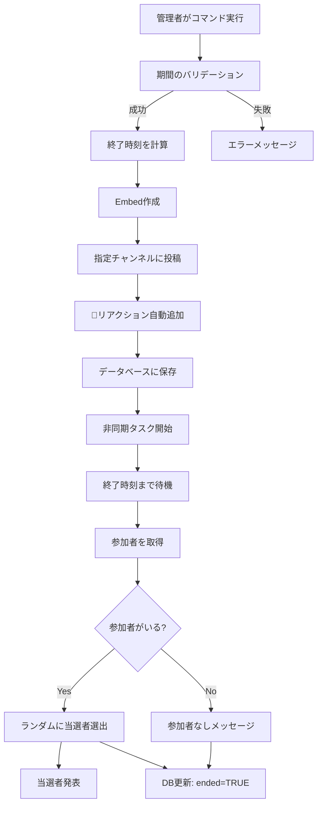

# ギブアウェイシステム

## 概要

COMETボットのギブアウェイシステムは、サーバー内で賞品を抽選するための自動化されたシステムです。リアクションベースの参加方式と、データベース管理による永続化を実現しています。

## 主要機能

### 1. ギブアウェイ作成 (`/giveaway`)

#### コマンド構文
```
/giveaway channel:<チャンネル> 期間:<期間> 賞品:<賞品名>
```

#### パラメータ

| パラメータ | 型 | 説明 | 例 |
|-----------|---|------|-----|
| channel | TextChannel/Thread | ギブアウェイを投稿するチャンネル | #giveaway |
| 期間 | String | 期間（単位付き） | 1d, 12h, 30m |
| 賞品 | String | 賞品の名前・説明 | Nitro 1ヶ月分 |

#### 期間の単位

| 単位 | 意味 | 例 | 秒数 |
|-----|------|-----|------|
| `s` | 秒 | 30s | 30 |
| `m` | 分 | 15m | 900 |
| `h` | 時間 | 24h | 86,400 |
| `d` | 日 | 7d | 604,800 |
| `w` | 週 | 2w | 1,209,600 |

#### 使用例

```
/giveaway channel:#giveaway 期間:1d 賞品:Discord Nitro 1ヶ月分
/giveaway channel:#events 期間:12h 賞品:グッズ
/giveaway channel:#general 期間:30m 賞品:カスタムロール
```

### 2. 動作フロー



### 3. ギブアウェイEmbed

#### 実行中の表示

```
🎉 Discord Nitro 1ヶ月分のギブアウェイ

🎉を押して参加しよう！

終了時間: 23時間後
作成者: @管理者
賞品: Discord Nitro 1ヶ月分
```

#### 終了後の表示

```
🎉 Discord Nitro 1ヶ月分のギブアウェイ

**終了しました！**
当選者: @ユーザー名

終了時間: 23時間前
作成者: @管理者
賞品: Discord Nitro 1ヶ月分
```

### 4. 当選者再抽選 (`/reroll`)

#### コマンド構文
```
/reroll message_id:<メッセージID>
```

#### 機能
- 終了済みギブアウェイの当選者を再抽選
- 既存の参加者から新たに抽選
- データベースに新しい当選者を記録

#### 使用方法

1. ギブアウェイメッセージを右クリック
2. 「メッセージIDをコピー」を選択
3. `/reroll message_id:メッセージID` を実行

#### 制約
- 終了済みのギブアウェイのみ対象
- 参加者が1人以上必要
- 元のメッセージが削除されていないこと

## データベース設計

### giveaways テーブル

```sql
CREATE TABLE giveaways (
    id SERIAL PRIMARY KEY,
    guild_id BIGINT NOT NULL,               -- サーバーID
    channel_id BIGINT NOT NULL,             -- チャンネルID
    message_id BIGINT NOT NULL,             -- メッセージID
    creator_id BIGINT NOT NULL,             -- 作成者ID
    prize TEXT NOT NULL,                    -- 賞品
    end_time TIMESTAMP NOT NULL,            -- 終了時刻
    ended BOOLEAN DEFAULT FALSE,            -- 終了フラグ
    winner_id BIGINT,                       -- 当選者ID
    created_at TIMESTAMP DEFAULT CURRENT_TIMESTAMP
);

-- インデックス
CREATE INDEX idx_giveaways_message ON giveaways(message_id);
CREATE INDEX idx_giveaways_ended ON giveaways(ended);
CREATE INDEX idx_giveaways_guild ON giveaways(guild_id);
```

### データ例

| id | guild_id | message_id | creator_id | prize | end_time | ended | winner_id |
|----|----------|------------|------------|-------|----------|-------|-----------|
| 1 | 123...789 | 987...654 | 456...123 | Nitro | 2025-01-02 | false | NULL |
| 2 | 123...789 | 321...654 | 456...123 | Boost | 2025-01-01 | true | 789...456 |

## 実装詳細

### 期間変換ロジック

```python
def convert_duration(self, duration: str) -> int:
    """
    期間文字列を秒数に変換
    
    Args:
        duration: 期間文字列（例: "1d", "12h"）
    
    Returns:
        int: 秒数、エラー時は負の値
            -1: 不正な単位
            -2: 数値変換エラー
    """
    try:
        value = int(duration[:-1])  # 最後の文字以外
        unit = duration[-1].lower()  # 最後の文字（単位）
        
        units = {
            's': 1,
            'm': 60,
            'h': 3600,
            'd': 86400,
            'w': 604800
        }
        
        if unit not in units:
            return -1
            
        return value * units[unit]
    except ValueError:
        return -2
```

### 非同期タスク管理

```python
class GiveawayCog(commands.Cog):
    def __init__(self, bot):
        self.bot = bot
        self.active_giveaways = {}  # message_id -> asyncio.Task
    
    async def end_giveaway_task(
        self,
        channel_id: int,
        message_id: int,
        end_time: datetime
    ):
        """
        ギブアウェイ終了タスク
        
        指定時刻まで待機し、終了処理を実行
        """
        # 終了時刻まで待機
        await discord.utils.sleep_until(end_time)
        
        # チャンネル取得
        channel = self.bot.get_channel(channel_id)
        if not channel:
            return
        
        try:
            # メッセージ取得
            message = await channel.fetch_message(message_id)
            
            # 🎉リアクションを取得
            reaction = discord.utils.get(message.reactions, emoji="🎉")
            if not reaction:
                return
            
            # Bot以外のユーザーを取得
            users = [
                user async for user in reaction.users()
                if not user.bot
            ]
            
            # 当選者選出
            if users:
                winner = random.choice(users)
                winner_text = winner.mention
                
                # 発表メッセージ
                await channel.send(
                    f"🎉 おめでとうございます！{winner.mention}が当選しました！"
                )
            else:
                winner = None
                winner_text = "参加者がいませんでした"
            
            # Embed更新
            embed = message.embeds[0]
            embed.color = discord.Color.gold()
            embed.description = f"**終了しました！**\n当選者: {winner_text}"
            await message.edit(embed=embed)
            
            # データベース更新
            async with db.pool.acquire() as conn:
                await conn.execute("""
                    UPDATE giveaways
                    SET ended = TRUE, winner_id = $1
                    WHERE message_id = $2
                """, winner.id if winner else None, message_id)
                
        except discord.NotFound:
            # メッセージが削除されている
            pass
        finally:
            # タスクリストから削除
            self.active_giveaways.pop(message_id, None)
```

### Bot再起動時の復元

```python
async def load_active_giveaways(self):
    """
    Bot起動時にアクティブなギブアウェイを復元
    """
    await self.bot.wait_until_ready()
    
    # データベースから未終了のギブアウェイを取得
    async with db.pool.acquire() as conn:
        active = await conn.fetch("""
            SELECT channel_id, message_id, end_time
            FROM giveaways
            WHERE ended = FALSE
        """)
    
    # 各ギブアウェイのタスクを再作成
    for row in active:
        channel_id = row['channel_id']
        message_id = row['message_id']
        end_time = row['end_time']
        
        # 終了時刻が未来の場合のみタスク作成
        if end_time > datetime.now():
            self.active_giveaways[message_id] = asyncio.create_task(
                self.end_giveaway_task(channel_id, message_id, end_time)
            )
```

## 参加者管理

### リアクションベースの参加

```python
# 参加方法
1. ギブアウェイメッセージに🎉をリアクション
2. 自動的に参加リストに追加

# 参加取り消し
1. 🎉リアクションを削除
2. 自動的に参加リストから除外
```

### 参加者の取得ロジック

```python
# メッセージからリアクションを取得
reaction = discord.utils.get(message.reactions, emoji="🎉")

# Bot以外のユーザーを取得（非同期イテレータ）
users = [
    user async for user in reaction.users()
    if not user.bot
]

# ランダムに当選者を選出
if users:
    winner = random.choice(users)
```

## エラーハンドリング

### 期間の検証

```python
duration = self.convert_duration(期間)

if duration == -1:
    # 不正な単位
    await interaction.response.send_message(
        "期間の指定が不正です。以下の単位を使用してください:\n"
        "s: 秒\nm: 分\nh: 時間\nd: 日\nw: 週",
        ephemeral=True
    )
    return

elif duration == -2:
    # 数値変換エラー
    await interaction.response.send_message(
        "期間は整数で指定してください",
        ephemeral=True
    )
    return
```

### 再抽選時のエラー

```python
# ギブアウェイが見つからない
if not result:
    await interaction.response.send_message(
        "指定されたギブアウェイが見つからないか、まだ終了していません",
        ephemeral=True
    )
    return

# メッセージが削除されている
try:
    message = await channel.fetch_message(message_id)
except discord.NotFound:
    await interaction.response.send_message(
        "メッセージが見つかりません",
        ephemeral=True
    )
    return

# 参加者がいない
if not users:
    await interaction.response.send_message(
        "参加者が見つかりません",
        ephemeral=True
    )
    return
```

## 権限管理

### 必要な権限

**コマンド実行**:
- `is_owner_app()`: サーバー管理者のみ
- `is_guild_app()`: サーバー内でのみ実行可能

**Bot権限**:
- `Send Messages`: メッセージ送信
- `Embed Links`: Embed送信
- `Add Reactions`: リアクション追加
- `Read Message History`: メッセージ履歴の読み取り

## セットアップガイド

### 1. データベース初期化

```python
async def setup_database(self):
    """ギブアウェイテーブルを作成"""
    async with db.pool.acquire() as conn:
        await conn.execute("""
            CREATE TABLE IF NOT EXISTS giveaways (
                id SERIAL PRIMARY KEY,
                guild_id BIGINT NOT NULL,
                channel_id BIGINT NOT NULL,
                message_id BIGINT NOT NULL,
                creator_id BIGINT NOT NULL,
                prize TEXT NOT NULL,
                end_time TIMESTAMP NOT NULL,
                ended BOOLEAN DEFAULT FALSE,
                winner_id BIGINT,
                created_at TIMESTAMP DEFAULT CURRENT_TIMESTAMP
            )
        """)
```

### 2. Cog登録

```python
async def setup(bot):
    cog = GiveawayCog(bot)
    await bot.add_cog(cog)
    
    # 初期化タスク
    bot.loop.create_task(cog.setup_database())
    bot.loop.create_task(cog.load_active_giveaways())
```

## ベストプラクティス

### 1. 適切な期間設定

```python
# 短すぎる期間は避ける（参加者が少なくなる）
❌ 期間:1m  # 1分は短すぎる

# 適切な期間
✅ 期間:1h   # 1時間
✅ 期間:12h  # 12時間
✅ 期間:1d   # 1日
```

### 2. わかりやすい賞品名

```python
# 具体的で魅力的な賞品名
✅ Discord Nitro 1ヶ月分
✅ サーバーブースト × 2
✅ カスタムロール（1ヶ月）

# 避けるべき例
❌ 賞品
❌ 何か
```

### 3. 専用チャンネルの使用

```python
# ギブアウェイ専用チャンネルを作成
✅ #giveaways
✅ #events

# 一般チャンネルは避ける
❌ #general
```

## トラブルシューティング

### Q: ギブアウェイが自動終了しない

**原因**:
- Bot再起動でタスクが消失
- データベース接続エラー
- end_timeが不正

**解決方法**:
```python
# load_active_giveaways()が正常に実行されているか確認
# ログを確認
logger.info(f"Loaded {len(active)} active giveaways")
```

### Q: 再抽選がでない

**原因**:
- メッセージIDが不正
- ギブアウェイが未終了
- 参加者がいない

**解決方法**:
```python
# メッセージIDを確認（18桁の数字）
# ギブアウェイの終了を確認
# 参加者のリアクションを確認
```

### Q: 当選者が表示されない

**原因**:
- 全参加者がBot
- リアクションが🎉以外

**解決方法**:
```python
# 人間のユーザーが参加しているか確認
# 🎉リアクションがあるか確認
```

## 拡張機能の提案

### 複数当選者

```python
# 当選者数を指定
@app_commands.command()
async def giveaway(
    self,
    interaction: discord.Interaction,
    channel: discord.TextChannel,
    期間: str,
    賞品: str,
    当選者数: int = 1  # 追加
):
    # 複数の当選者を選出
    winners = random.sample(users, min(当選者数, len(users)))
```

### 参加条件

```python
# ロール条件
required_role = interaction.guild.get_role(role_id)
users = [
    user async for user in reaction.users()
    if not user.bot and required_role in user.roles
]
```

### 統計機能

```python
# ギブアウェイ統計
@app_commands.command()
async def giveaway_stats(self, interaction: discord.Interaction):
    async with db.pool.acquire() as conn:
        stats = await conn.fetchrow("""
            SELECT
                COUNT(*) as total,
                COUNT(*) FILTER (WHERE ended) as ended_count,
                COUNT(DISTINCT creator_id) as creators
            FROM giveaways
            WHERE guild_id = $1
        """, interaction.guild_id)
```

## 関連ドキュメント

- [データベース管理](../../04-utilities/01-database-management.md)
- [ツールCogs概要](../05-tool-cogs.md)
- [管理者コマンド](../../06-commands/02-admin-commands.md)
