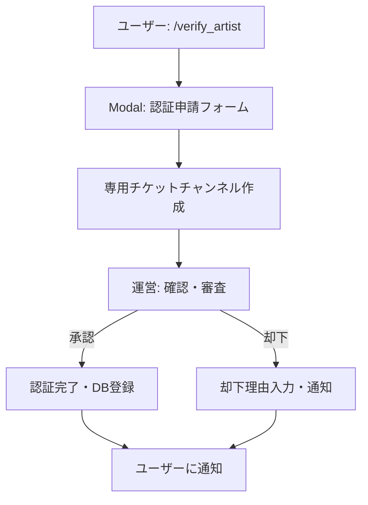

# AUS (Art Unauthorized-repost Shield) Cogs

## 概要

AUS (Art Unauthorized-repost Shield) は、Discord コミュニティにおける無断転載ファンアートを自動検出し、絵師の権利を保護する統合システムです。AI技術を活用した画像検出、絵師認証システム、モデレーション機能を提供します。

## システムアーキテクチャ

```
cogs/aus/
├── __init__.py                    # Cogs セットアップ・エントリーポイント
├── database.py                    # データベース管理・クエリ
├── image_detection.py             # 画像検出ロジック（SauceNAO + Google Vision）
├── artist_verification.py         # 絵師認証システム
├── moderation.py                  # 運営管理コマンド
└── views/                         # Discord Component V2 Views
    ├── __init__.py
    ├── notification_views.py      # 検出通知用インタラクティブUI
    └── verification_views.py      # 認証チケット用UI
```

## 主要機能

### 1. 自動画像検出システム

#### 動作フロー

1. **メッセージ監視**: 全チャンネル・スレッド・フォーラムの画像を自動監視
2. **除外チェック**: 認証済み絵師・除外チャンネルのチェック
3. **2段階検出**:
   - **SauceNAO API**: 類似画像検索
   - **Google Cloud Vision API**: OCR・ロゴ検出
4. **Twitter出典検出**: URL・ハンドルネーム自動抽出
5. **モデレーション通知**: 運営チャンネルへの即座通知

#### 技術仕様

```python
class ImageDetection(commands.Cog):
    def __init__(self, bot):
        self.bot = bot
        self.saucenao_api_key = os.getenv('SAUCENAO_API_KEY')
        self.mod_channel_id = int(os.getenv('AUS_MOD_CHANNEL_ID'))
        
    @commands.Cog.listener()
    async def on_message(self, message):
        """メッセージ内の画像を自動検出"""
        if await self._should_skip_detection(message):
            return
            
        for attachment in message.attachments:
            if attachment.content_type.startswith('image/'):
                await self._analyze_image(message, attachment)
```

#### API統合

**SauceNAO API**:
- 類似度スコアによる判定
- Twitter・pixiv・その他ソースの検出
- レート制限対応

**Google Cloud Vision API** (オプション):
- OCR機能でハンドルネーム検出
- ロゴ検出機能
- 安全性検索

### 2. 絵師認証システム

#### 認証フロー



#### データベーススキーマ

**verified_artists テーブル**:
```sql
CREATE TABLE verified_artists (
    user_id BIGINT PRIMARY KEY,
    twitter_handle TEXT NOT NULL,
    twitter_url TEXT,
    verified_at TIMESTAMP WITH TIME ZONE DEFAULT CURRENT_TIMESTAMP,
    verified_by BIGINT NOT NULL,
    notes TEXT
);
```

**verification_tickets テーブル**:
```sql
CREATE TABLE verification_tickets (
    ticket_id SERIAL PRIMARY KEY,
    user_id BIGINT NOT NULL,
    twitter_handle TEXT NOT NULL,
    twitter_url TEXT,
    proof_description TEXT NOT NULL,
    status TEXT DEFAULT 'pending',
    created_at TIMESTAMP WITH TIME ZONE DEFAULT CURRENT_TIMESTAMP,
    resolved_at TIMESTAMP WITH TIME ZONE,
    resolved_by BIGINT,
    channel_id BIGINT,
    rejection_reason TEXT
);
```

### 3. インタラクティブUI

#### 検出通知View

```python
class DetectionNotificationView(discord.ui.View):
    """無断転載検出時の運営用インタラクティブUI"""
    
    def __init__(self):
        super().__init__(timeout=None)
        
    @discord.ui.button(label="🚨 即座に削除", style=discord.ButtonStyle.danger)
    async def delete_message(self, interaction, button):
        """メッセージを即座に削除"""
        
    @discord.ui.button(label="✓ 確認済み", style=discord.ButtonStyle.success)
    async def mark_verified(self, interaction, button):
        """手動確認完了をマーク"""
        
    @discord.ui.button(label="📝 補足/異議", style=discord.ButtonStyle.secondary)
    async def add_note(self, interaction, button):
        """フィードバックModal表示"""
```

#### 認証チケットView

```python
class VerificationTicketView(discord.ui.View):
    """絵師認証チケット用UI"""
    
    @discord.ui.button(label="✅ 承認", style=discord.ButtonStyle.success)
    async def approve_verification(self, interaction, button):
        """認証を承認しDBに登録"""
        
    @discord.ui.button(label="❌ 却下", style=discord.ButtonStyle.danger)
    async def reject_verification(self, interaction, button):
        """認証を却下（理由入力Modal）"""
```

## コマンドリファレンス

### ユーザーコマンド

#### `/verify_artist`
絵師認証を申請

**必要権限**: なし  
**UI**: Discord Modal

**申請フォーム**:
- Twitterハンドルネーム
- TwitterプロフィールURL
- 本人確認方法の説明

#### `/artist_info [@user]`
認証情報を表示

**必要権限**: なし  
**パラメータ**: 
- `user` (オプション): 確認するユーザー、省略時は自分

### 運営コマンド

#### `/aus_stats`
システム統計表示

**必要権限**: `manage_guild`  
**表示内容**:
- 総検出数
- 認証済み絵師数
- 処理済み/未処理検出数
- 保留中のチケット数

#### `/aus_list_artists`
認証済み絵師一覧

**必要権限**: `manage_guild`  
**表示形式**: ページネーション対応リスト

#### `/aus_remove_artist <user>`
絵師認証を解除

**必要権限**: `manage_guild`  
**パラメータ**:
- `user` (必須): 解除するユーザー

#### `/aus_pending_tickets`
未解決チケット一覧

**必要権限**: `manage_guild`  
**表示内容**: ステータス・作成日時・申請者

## セットアップガイド

### 1. データベースマイグレーション

```bash
psql $DATABASE_URL -f migrations/create_aus_tables.sql
```

### 2. 環境変数設定

`.env` ファイルに以下を追加:

```bash
# 必須設定
AUS_MOD_CHANNEL_ID=123456789012345678  # 検出通知送信先
SAUCENAO_API_KEY=your_saucenao_api_key_here

# オプション設定
AUS_TICKET_CATEGORY_ID=123456789012345678  # チケットカテゴリID
AUS_MOD_ROLE_ID=123456789012345678         # モデレーターロールID
AUS_EXCLUDED_CHANNEL_IDS=111,222,333       # 除外チャンネルID（カンマ区切り）
AUS_EXCLUDED_CATEGORY_IDS=444,555          # 除外カテゴリID（カンマ区切り）

# Google Cloud Vision API（オプション）
GOOGLE_APPLICATION_CREDENTIALS=/path/to/google-credentials.json
```

### 3. API Key取得

**SauceNAO API**:
1. [SauceNAO](https://saucenao.com/user.php) にアクセス
2. アカウント登録・ログイン
3. API Key を取得
4. プラン選択（Basic: 無料、Mega: $50/月推奨）

**Google Cloud Vision API** (オプション):
1. [Google Cloud Console](https://console.cloud.google.com/) にアクセス
2. プロジェクト作成
3. Vision API を有効化
4. サービスアカウント作成
5. 認証情報JSONをダウンロード
6. 環境変数にパス設定

### 4. Cogsロード

`main.py` で自動ロード:

```python
@bot.event
async def on_ready():
    await bot.load_extension('cogs.aus')
    await bot.tree.sync()
```

### 5. Persistent Views設定

```python
@bot.event
async def on_ready():
    # AUS Persistent Views を登録
    from cogs.aus.views import DetectionNotificationView, VerificationTicketView
    bot.add_view(DetectionNotificationView())
    bot.add_view(VerificationTicketView())
```

## パフォーマンス最適化

### キャッシング戦略

```python
from functools import lru_cache

@lru_cache(maxsize=100)
async def is_verified_artist(user_id: int) -> bool:
    """認証状態をキャッシュ"""
    return await db.check_verification(user_id)
```

### レート制限対応

```python
class RateLimiter:
    def __init__(self):
        self.requests = {}
        
    async def check_limit(self, key: str, limit: int, window: int) -> bool:
        """API呼び出しのレート制限チェック"""
        current_time = time.time()
        if key not in self.requests:
            self.requests[key] = []
            
        # 古いリクエストを削除
        self.requests[key] = [
            t for t in self.requests[key] 
            if current_time - t < window
        ]
        
        if len(self.requests[key]) >= limit:
            return False
            
        self.requests[key].append(current_time)
        return True
```

## トラブルシューティング

### 画像検出が動作しない

**原因**:
- `AUS_MOD_CHANNEL_ID` の設定ミス
- SauceNAO API Keyの無効化/制限
- `message_content` Intentの無効化

**解決方法**:
```python
# Developer Portalで確認
intents = discord.Intents.default()
intents.message_content = True  # 必須
```

### Persistent Viewsが動作しない

**原因**:
- Bot再起動後のView登録忘れ
- custom_idの不一致

**解決方法**:
```python
# custom_idを明示的に指定
class MyView(discord.ui.View):
    def __init__(self):
        super().__init__(timeout=None)
        
# on_readyで再登録
bot.add_view(MyView())
```

### Google Cloud Vision エラー

**原因**:
- 認証情報パスの誤り
- API権限不足
- 課金アカウント未設定

**解決方法**:
1. `GOOGLE_APPLICATION_CREDENTIALS` パス確認
2. サービスアカウント権限確認
3. 課金アカウント有効化

## セキュリティ考慮事項

### データ保護

```python
# 機密情報のログ出力防止
import logging
logging.getLogger('google.auth').setLevel(logging.WARNING)

# APIキーの暗号化保存推奨
from cryptography.fernet import Fernet
```

### 権限管理

```python
@commands.has_permissions(manage_guild=True)
async def admin_command(ctx):
    """管理者コマンドの権限チェック"""
    pass
```

## 関連ドキュメント

- [データベース管理](../04-utilities/01-database-management.md)
- [API統合](../04-utilities/02-api-integration.md)
- [セキュリティガイドライン](../05-development/03-security-guidelines.md)
- [トラブルシューティング](../07-operations/04-troubleshooting.md)

## バージョン履歴

- **v1.0** (2025-11-06): 初回リリース
  - SauceNAO + Google Cloud Vision統合
  - 絵師認証システム実装
  - Component V2対応UI
  - Persistent Views実装
